# 基于Hidden Markov map matching的GPS路径匹配与可视化，以及基于深度生成模型的行程时间分布学习

## 数据集为哈尔滨市某段时间内的上万辆出租车的GPS位置数据[dataset](https://drive.google.com/open?id=1tdgarnn28CM01o9hbeKLUiJ1o1lskrqA)(为h5文件)

>本项目基于该论文：Xiucheng Li, Gao Cong, Aixin Sun, and Yun Cheng. 2019. Learning Travel Time Distributions with Deep Generative Model. In Proceedings of the 2019 World Wide Web Conference (WWW ’19), May 13–17, 2019, San Francisco, CA, USA. ACM, New York, NY, USA, 11 pages. https://doi.org/10.1145/3308558.3313418

## 部分代码参考以下仓库：
1. [Barefoot](https://github.com/boathit/barefoot)
2. [DeepGTT](https://github.com/boathit/deepgtt)

## 路径可视化基于[Open Street Map](https://www.openstreetmap.org/)开源地图数据

## 学习并预测行程时间分布而非均值的意义：

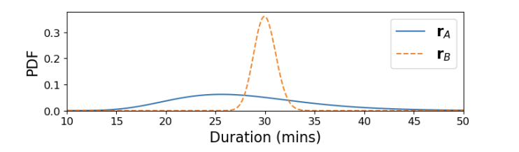

假设$r_A$和$r_B$是两条起点和终点相同的路径，由于不同的路况，选择这两条路线所需要消耗的时间的PDF(概率密度函数)图像如图。

我们可以看出，$r_A$的均值为$u_A=25min$，$r_B$的均值为$u_B=30min$

对于只给出均值时间的模型，我们毫无疑问会选择$r_A$

但是，如果我们现在的情况是：我们一定要在35分钟内到达目的地(例如飞机就快起飞了，如果35分钟内未能抵达机场，就会错过该航班)，那么根据上图的PDF，我们应该选择$r_B$，虽然它的均值长出了5分钟，但是它在35分钟后的概率几乎为0，而$r_A$仍有一定概率在35分钟内无法抵达目的地

综上所述，学习行程的时间分布而非均值是很有实际意义的。事实上，不仅在**行程规划**，在**路径恢复**方面，行程时间分布也能提供更高的准确度

# 正式开始(数据集为哈尔滨市某段时间内的上万辆出租车的GPS位置数据)

# 我使用的操作系统是MacOS，M芯片

>理论上Ubuntu也行，我使用的是MacOS(M2)，windows没有进行过测试

## Barefoot

### Map Server

Map Server的作用是搭建一个**PostgreSQL**数据库，在本地作为服务器为后续**Map Match**和**行程的可视化**提供地图数据(来自Open Street Map)

1. 需要准备的环境
    
    * Docker
    * [osmosis](https://wiki.openstreetmap.org/wiki/Osmosis/Installation) 
    * java
    * 在barefoot内操作

2. 下载**Open Street Map**上的数据集并提取出我们要的区域(哈尔滨市区)

    ```bash
    // 以下指令下载地图数据，如果使用我配置好的镜像的话理论上不需要再下载并划分地图数据(没有实际尝试过)
    cd barefoot/map/osm/

    curl http://download.geofabrik.de/asia/china-latest.osm.pbf -o barefoot/map/osm/china.osm.pbf

    osmosis --read-pbf file=china.osm.pbf --bounding-box left=126.506130 right=126.771862 bottom=45.657920 top=45.830905 --write-pbf file=harbin.osm.pbf
    ```

3. 拉取配置好的Docker镜像

    > 这里可以直接使用我已经配置好的镜像(包括所需数据库的数据也已经导入好)

    ```
    docker pull arcueidtype/barefoot_map
    ```

    如果从头使用的话可以参考[Barefoot](https://github.com/boathit/barefoot)仓库中的内容

4. 创建Docker容器
    ```
    docker run -it -p 5432:5432 --name="harbin-map" -v ${PWD}/map/:/mnt/map arcueidtype/barefoot_map:latest
    ```

5. 将OSM的数据导入数据库

    >这一步如果使用上述镜像发现已经有数据库的话就不需要操作了，如果要操作，则是在运行中的容器中执行，而不是本机！

    ```
    bash /mnt/map/osm/import.sh
    ```

6. 用pgAdmin(v4.24)检查数据库导入情况

    连接到服务器，地址`127.0.0.1`，端口`5432`，如果看到以下十张表就算成功了

    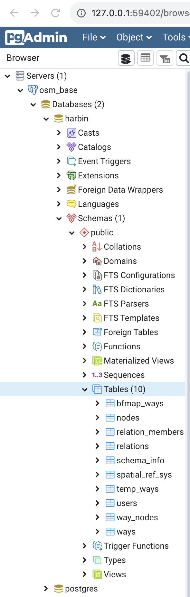

    可以用插件可视化数据集中的**兴趣点**和**道路**

    >由于兴趣点过多，这里只展示了一小部分

    

    >道路(局部)

    

### Matching Server

Matching Server基于Hidden Markov Map Matching，处理传入的位置数据，将他们匹配到对应的路径上，并给出匹配好的路径编号

1. 需要准备的环境

    * Maven
    * Java JDK7(版本过高会出问题)

2. 为Barefoot打包并添加依赖

    >仓库中的内容理论上是添加过依赖的，但是不知道直接使用有没有问题，如果有问题还是按照原仓库搭建

    ```bash
    mvn package -DskipTests
    ```

3. 运行Matching Server

    ```bash
    java -jar target/barefoot-0.1.5-matcher-jar-with-dependencies.jar --slimjson config/server.properties config/harbin.properties
    ```

## 路径匹配

>现在开始进入目录deepgtt中

* 需要[Julia](https://julialang.org/downloads/) >= 1.0
* Python >= 3.6(numpy版本过新会有一些问题，我已经对源代码进行过修改，所以现在也不会有问题)
* PyTorch(我用的是2.1.1，理论上>=0.4)

经历上述艰辛的过程，我们终于打好了**Map Server**和**Matching Server**这两个基础，接下来我们就可以利用它们对我们的数据集进行路径匹配了

### 数据集

请将下载的h5文件放在目录`data/h5path`中

[下载数据集](https://drive.google.com/open?id=1tdgarnn28CM01o9hbeKLUiJ1o1lskrqA)(为h5文件)

下载并解压后，可以使用**HDFView**来查看下载下来的数据集内容

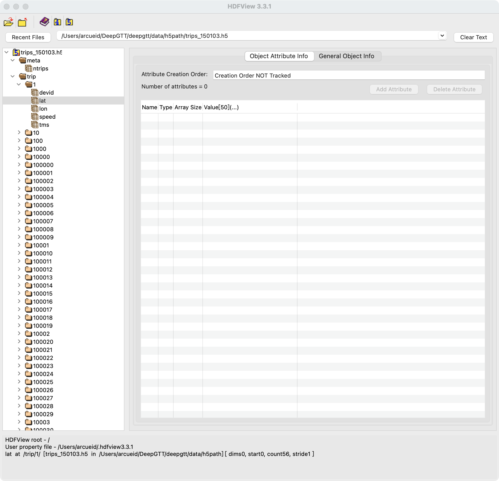

可以看到，我们拿到的数据集中包括了该文件中总行程数。对于每个行程，都有经纬度，速度，时间，划分这些信息。

**plot_matched_ways.py**中也有可视化GPS点的代码(如果没有匹配好的行程数据集，可能需要调整注释和缩进)

随便挑选一个行程的GPS进行绘制：

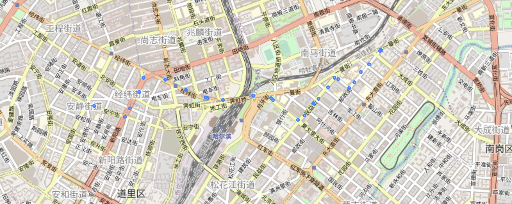

>其实这里就可以发现，由于采样间隔时间问题，GPS点可能会稀疏，导致match后的路径并不是连续的。事实上，大部分匹配出来的路径都不是连续的，但是这并不影响我们用它来训练模型

接下来我们就用这些信息和刚刚搭建的服务器来匹配路径。

### 获取匹配后的路径数据集(数据预处理)

将GPS点匹配到路径上其实就是一种数据的预处理，通过原始的GPS数据得到新的路径数据

设置并运行好**Map Server**和**Matching Server**

接下来使用`mapmatch.jl`来使用上述服务器进行匹配

在目录`harbin/julia`下执行指令：

```
julia -p 8 mapmatch.jl --inputpath {h5path} --outputpath {jldpath}
```

其中，8是可用的CPU核心数，{h5path}和{jlpath}为目录下`data`目录中这两个文件夹的路径

### 路径匹配的过程十分漫长(可能是MacBook Air的性能不足，我匹配完所有数据耗时约2天)

该脚本运行完后得到的是一系列`jld2`文件，我们要通过`gentraindata.jl`脚本将它们转回`h5`文件

使用下述指令：

```
julia gentraindata.jl --inputpath {jldpath} --outputpath {trainpath}
```

{}仍然表示对应文件夹的路径(均在`data`目录下)

等待执行完成后，我们就得到了一系列包含路径的`h5`数据集

同样使用**HDFView**，我们可以看到我们匹配后的数据集

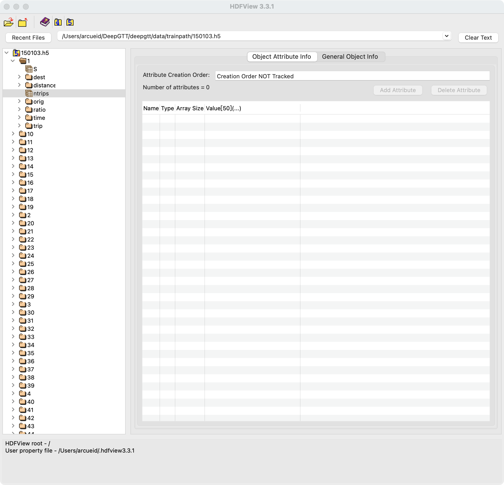

每一个路径的组成都是一系列**gid**(在Map Server数据中道路的编号)：

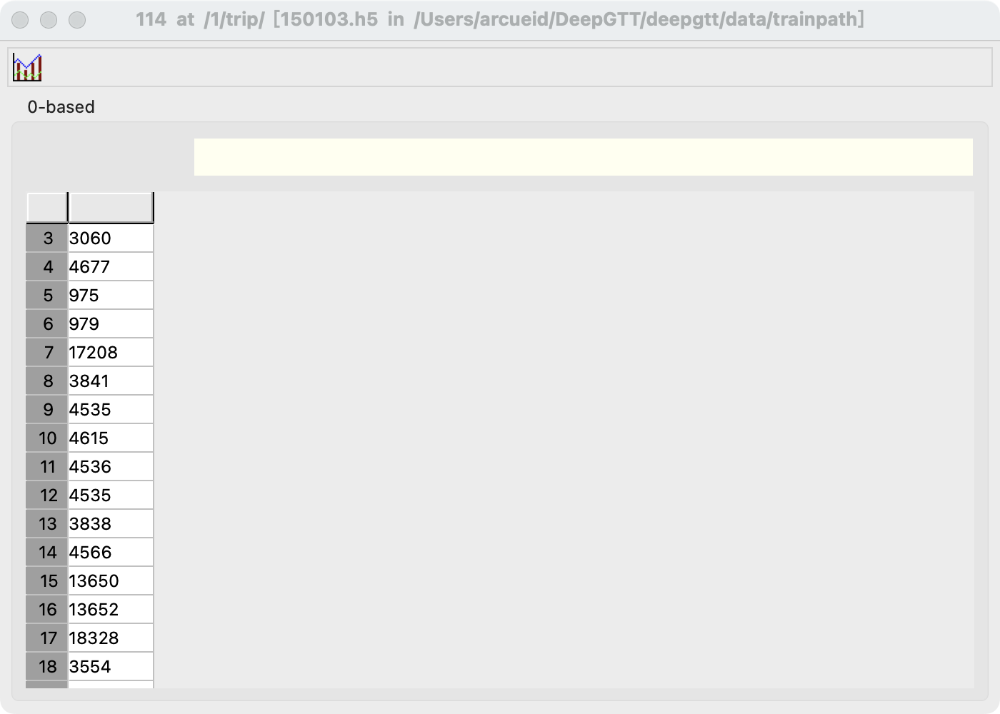

但是，我们拿到的只是一个个编号，我们并不知道真实的行程到底是怎么样的，所以，接下来我们将对该数据集中匹配后的路径进行可视化

## 路径可视化

### 基于geopandas对路径进行可视化

相关代码位于`deepgtt`目录下的`plot_matched_ways.py`中

>该文件在前文中用于绘制GPS点，事实上该代码一开始写出来是为了可视化匹配好的路径的(从文件名中也可以看出)，所以该代码中有大量注释部分，如果要展示`不同的类型以及不同的路径`，需要`调整注释和代码内容`，还是比较麻烦的，所以这只是一开始的做法，后续将其制作成了`Visual Server`，用Web应用的方式更方便的展示可视化的结果

**geopands**提供了两种可视化的方式，一种是用`pyplot`，还有就是通过开源的地图数据绘制可交互式的地图(例如**OpenStreetMap**)

* 使用**pyplot**

    * GPS
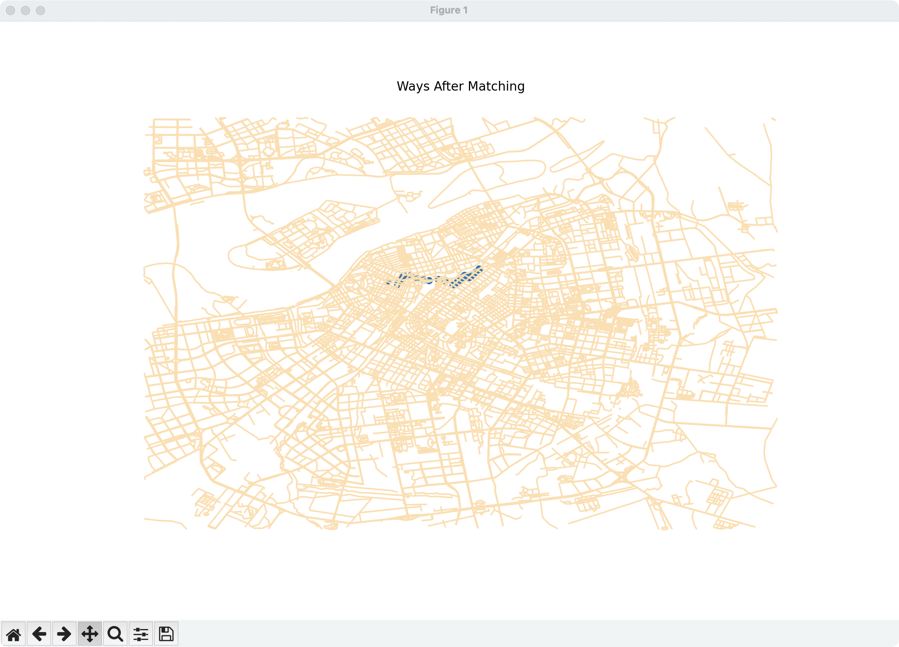

    * Trip
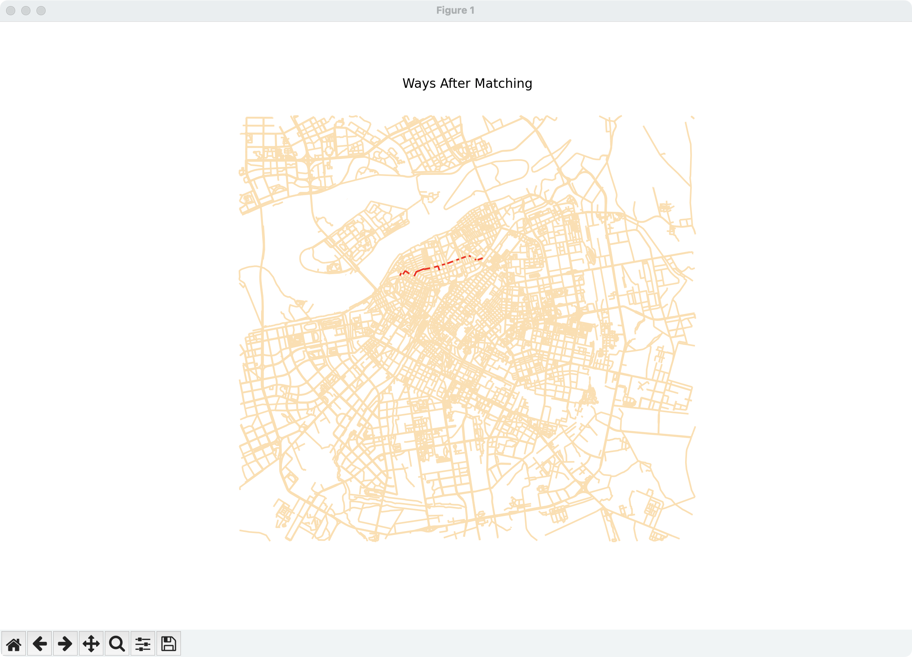

使用pyplot绘制的效果可以说是~~非常差~~

* 使用**explore**

    * GPS


    * Trip


用explore得到的可交互式地图的效果明显要比pyplot好了很多，但是，现在问题是，我们有那么多条路径，每次我们要看不同编号的道路时，还需要去修改python代码，并且每次都要重新读取一遍h5数据集，非常非常麻烦

为了改善上述问题，接下来就将引出**Visual Server**

## Visual Server

源代码在目录`VisualServer`中

Visual Server是基于`.NET CORE 8.0`搭建的网站，可以通过可视化的按钮选择不同的GPS点或路径编号来方便的可视化对应的结果

## 由于匹配后的路径编号和GPS点的编号并不是简单的一一匹配的关系，所以选择将二者的可视化分开而不是同时画出！！！

由于时间有限加上美术设计能力不足，界面并不好看......

>由于数据集过大，并没有读取全部的数据，只截取了部分！

Visual Server网页：

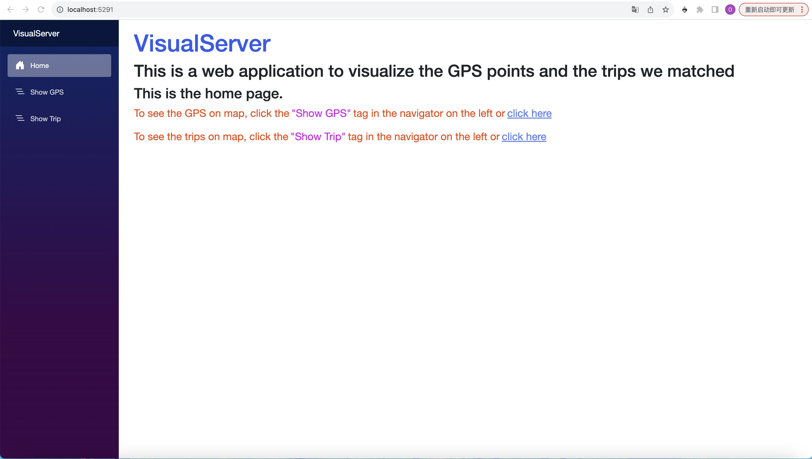

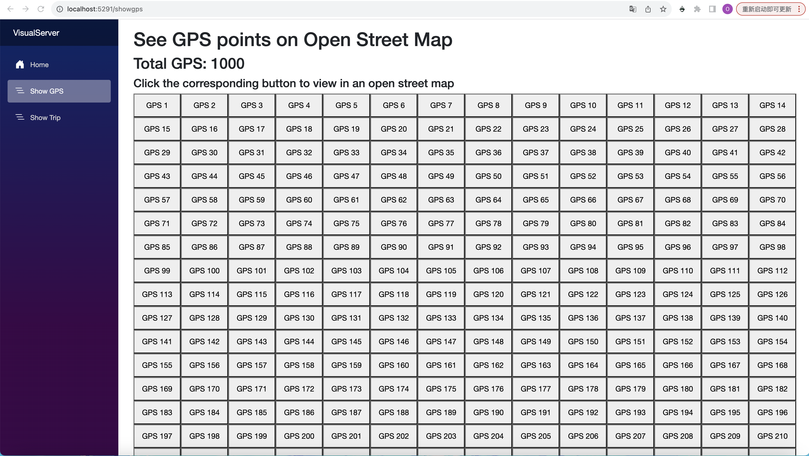

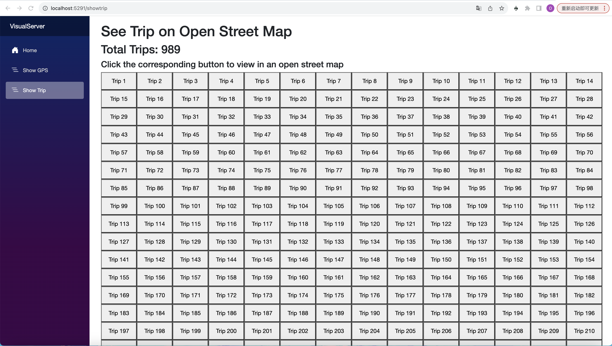

通过单击相应的按钮，就能可视化的查看对应编号的数据：

* GPS(由蓝点标出)：


* Trip(由红线画出)：


### Visual Server原理简介：

Visual Server的运行基于两个Socket服务器：`GPS Server`和`Path Server`

这两个服务器用Python编写，源代码位于deepgtt目录下，文件名`gps_server.py`和`path_server.py`

两个服务器都会提前读取好数据集，然后监听请求，Visual Server通过Socket通信，发送需要可视化的编号给对应类型的服务器(gps或者trip)，服务器收到编号后，绘制对应编号的内容，然后将html文件(绘制好的地图其实是一个html文件)交给Visual Server，最后由Visual Server再将该html文件展示给用户(通过浏览器)

所以，正常的启动顺序是先运行两个py服务器，然后再使用指令```dotnet watch```运行Visual Server(实际上顺序不是很重要，只要点击按钮时对应的服务器正常运行即可，否则会没有反应)

## 学习行程时间分布

最后的部分是通过预处理后的数据(匹配得到的路径)和其他附加数据(时间，路况等)学习不同道路的行程时间分布

### 划分训练集，验证集和测试集

在目录`deepgtt`下：

```bash
mv data/trainpath/150106.h5 data/validpath && mv data/trainpath/150107.h5 data/testpath
```

### 训练

>训练时要确保`Map Server`处于运行状态(postgresql的地图数据库服务器处于运行状态)

**注意这里我把训练的设备强制为`mps`了，如果是非Mac请使用`train.py`中被注释掉的设备选择**

切换到目录`deepgtt/harbin/python`

```bash
python train.py -trainpath {trainpath} -validpath {validpath} -kl_decay 0.0 -use_selu -random_emit
```

再次提醒大括号是对应目录路径，在`deepgtt/data`目录下

接下来等待训练......

### 测试

训练完成后，我们就可以进行测试了：

```bash
python estimate.py -testpath {testpath}
```

结果：
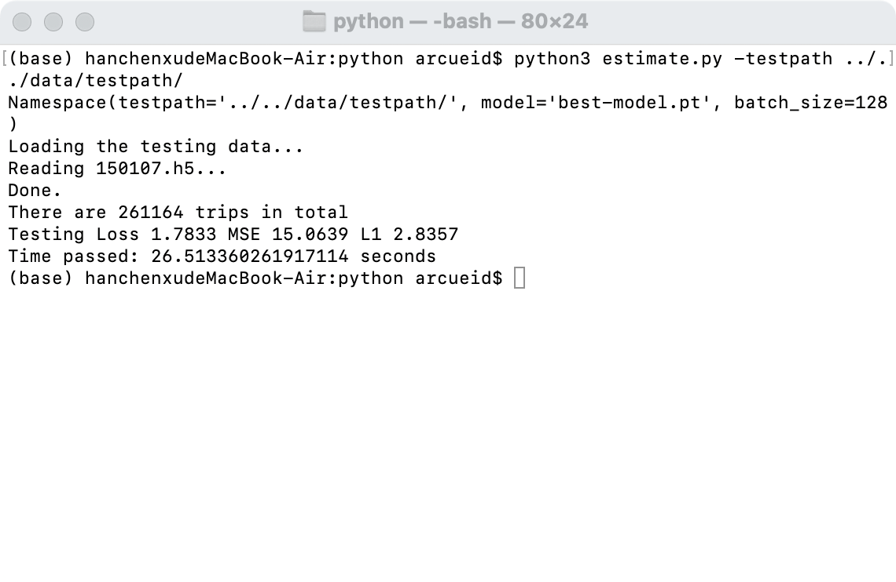

### 至此，就是全部内容了，感谢阅读！
