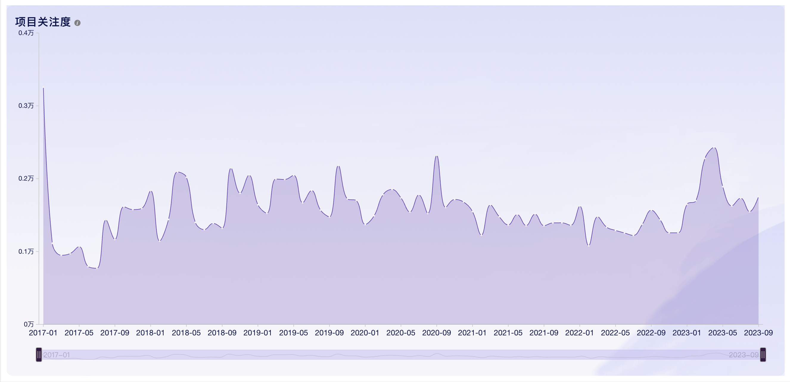
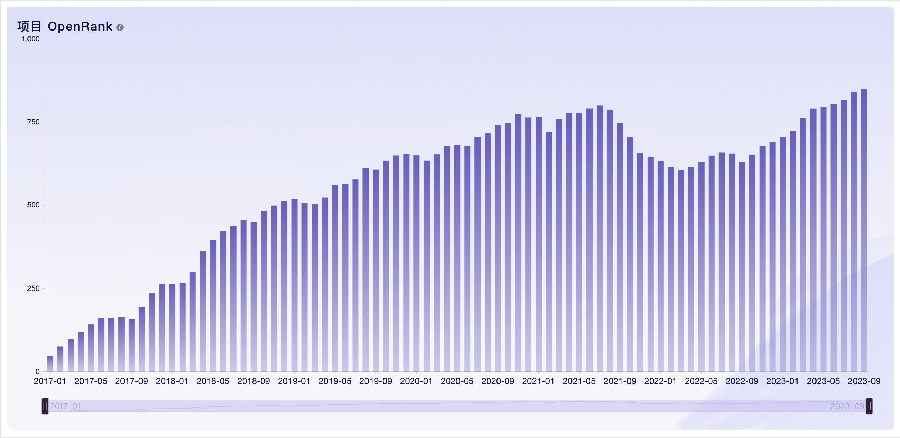
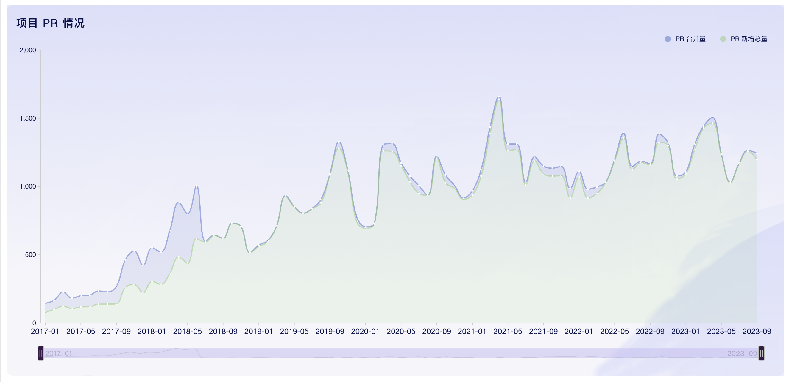
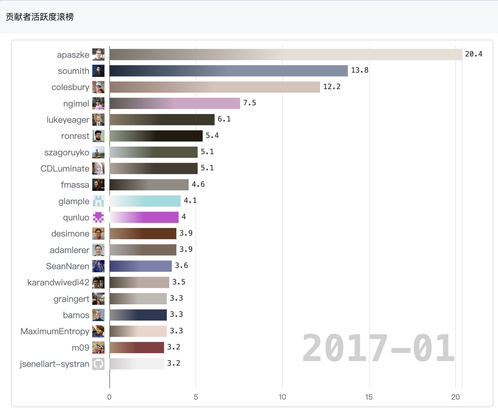
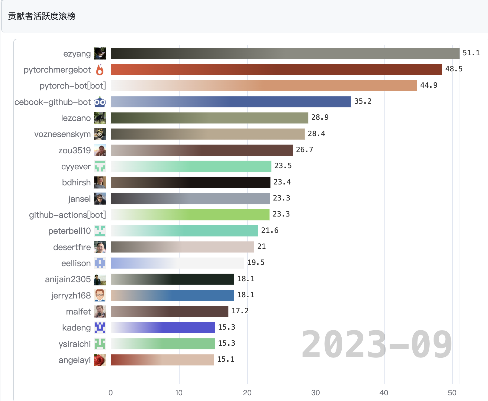
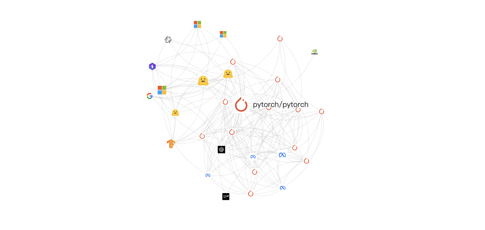
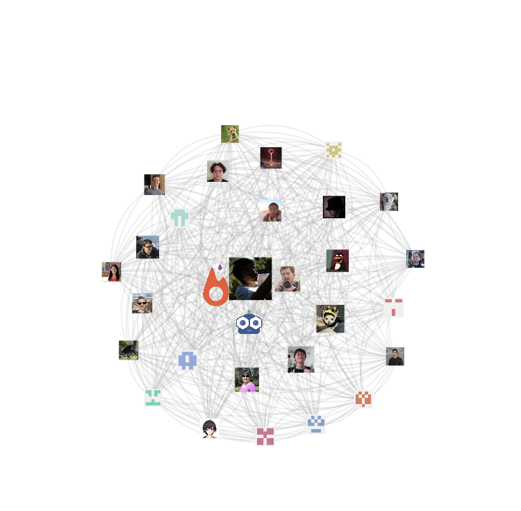

# 通过Hypercrx插件对开源项目分析

## Author: Chenxu Han@ArcueidType

## Student ID: 10225101440

## 分析的项目: PyTorch

*PyTorch是一个常用的机器学习python库*

### Open-Leaderboard洞察大屏: 

#### *项目关注度*

可以看到项目关注度在`PyTorch`诞生之时是最高的，之后一直保持在一个平均水平，在`23年`左右有一个较小的升高，推测与`ChatGPT`大火有一定的关系

#### *OpenRank*

可以发现`PyTorch`项目自诞生以来的影响力总体是呈上升趋势的

#### *PR情况*

可以发现，在中后期，PR`新增总量`和`合并总量`基本相同

### Hypercrx Perceptor

#### *贡献者活跃度滚动榜*

> 项目开始时

> 现在

项目建成时，主要的贡献者都是有名的PyTorch创始人，如`Adam Paszke`和`Soumith`

现在的主要贡献者则是`ezyang`，是一位来自中国的大佬

#### *项目关系网格图*

从网格图中，我们可以看到几个熟悉的身影，包括`微软`，`谷歌`，以及近期大火的`ChatGPT`的`“父亲”OpenAI`，还有提供硬件支持(`特别是GPU`)的`Nvidia`等等

#### *项目活跃开发者协作网络图*

可以发现，各大开发者之间的协作网络还是非常稠密的，并且贡献越多的开发者越位于中心

## 总结

`PyTorch`作为当今热门的python机器学习库，项目在发展的这几年中都保持着很高的热度，尤其在人工智能话题重新回到人们关注的重心的当下，PyTorch也会变得越来越热门
