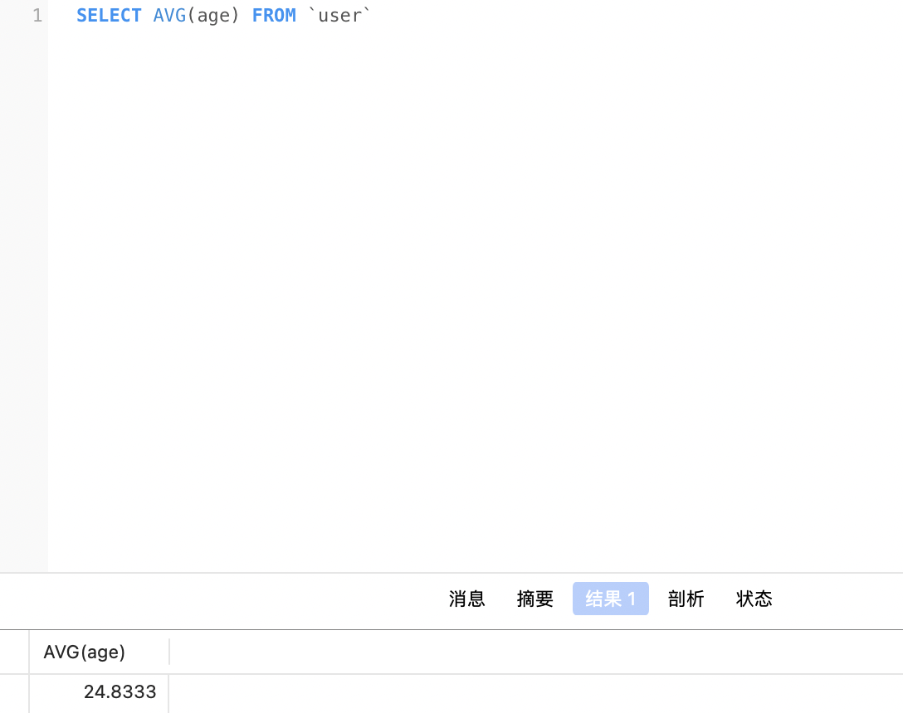

# Introduction to Data Science and Engineering Week 5

## Author: Chenxu Han@ArcueidType
## Student ID: 10225101440

## Week 5 practices:

## Chapter 6: 

### Practice 1:

> Source code is in `./despider/despider/spiders/douban.py`

Result:

## Practice 2, 3, 4:

> We omit the details of getting start with `scarpy` and we come to dangdang directly

> Source code in `./despider/despider/spiders/dangdang.py`

In `prac4` we choose to `callback` method parse for crawling the linked pages `(Here we only crawl the link that point to next page)`

> Here is the result with data saved in database: 

### Practice 5: 

> For there is nothing useful in deatailed page, we will only descibe the method to crawl all detailed pages

As we had done before, we can `easily` get the urls pointing to detailed pages. Therefore, we `only` need to consider the issue that how to handle these new urls which have `totally different` paradigm in `web pages(html)`

Actually, we can define another method`(such as parse_new)` to get information from the new paradigm

> Then we only need to use the key word `yield` followed by `scrapy.Request(url, callback=parse_new)` to callback the new method and get information from the page

## Chapter 7: 

### Practice 1, 2, 3:

> We use Navicat to configure database

> It is easy to use GUI to configure user's permissons

> We use `CREATE TABLE` to create a new table `user` in a database

> All SQL queries that used are in `./SQL/*.sql`

Result of table we created:

* Be advised, we use bit to denote gender that male is 1 and female is 0

> The table used below may be different with the table showed above!

### Practice 4: 

Result:

### Practice 5:

Result:

### Practice 6:

Result:

### Practice 7:

Result:

### Practice 8:

### Practice 9:

Result:

### Practice 10:

Result:

