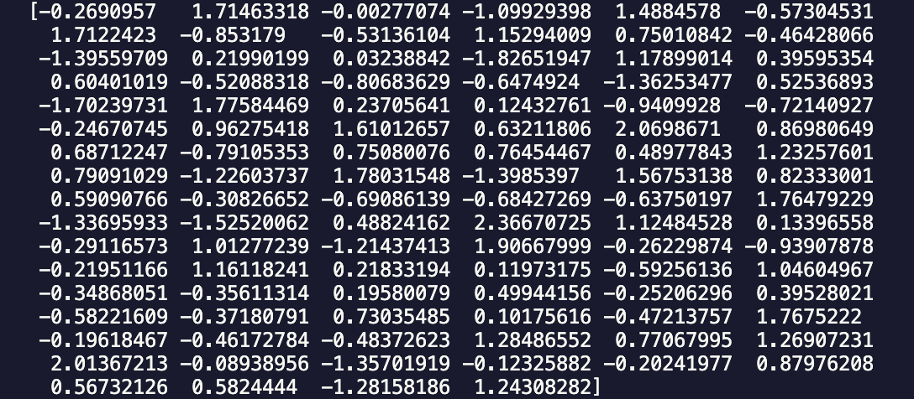
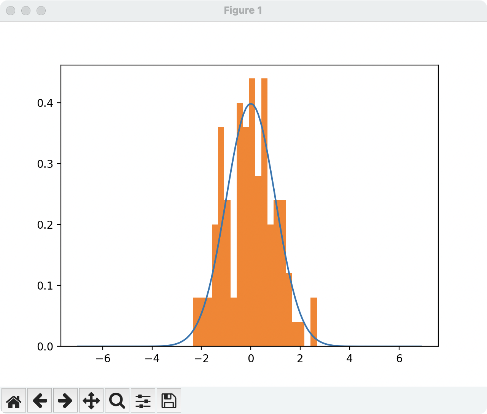
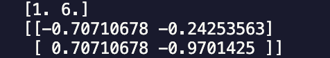
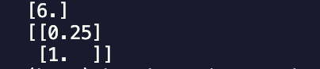
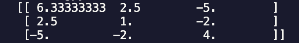
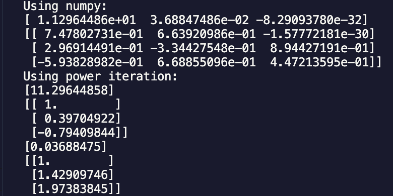

# Introduction to Data Science and Engineering Week 6

## Author: Chenxu Han@ArcueidType
## Student ID: 10225101440

## Week 6 practices:

### Practice 1: 

Result: 

### Practice 2:

Result: 

> The blue curve is true Gauss Distribution 

### Practice 3: 

Result:

> Every row of the matrix is an `eigenvector` corresponding to the `eigenvalue` in the array above

### Practice 4:

Result:

### Practice 5: 

Result: 

### Practice 6:

> Noticed that one eigenvalue is too small that can hardly be calculated and would lost precison using inverse power iteration. 

> Therefore, we only calculate the other 2 eigenvalues which are larger

Result:

