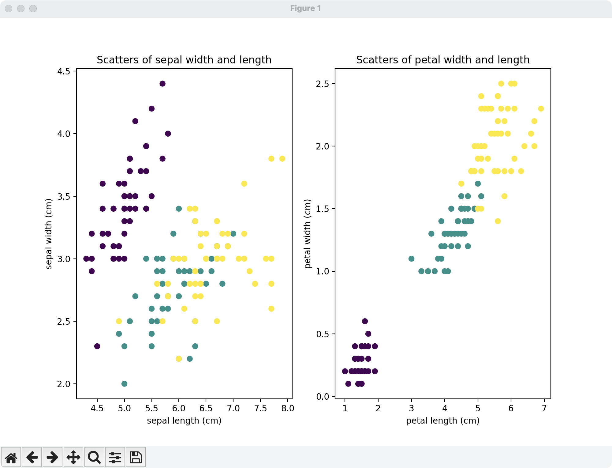
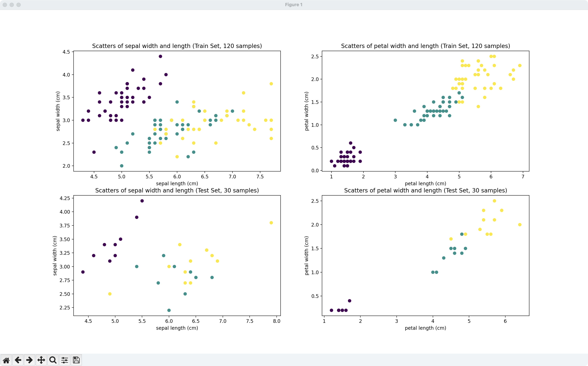
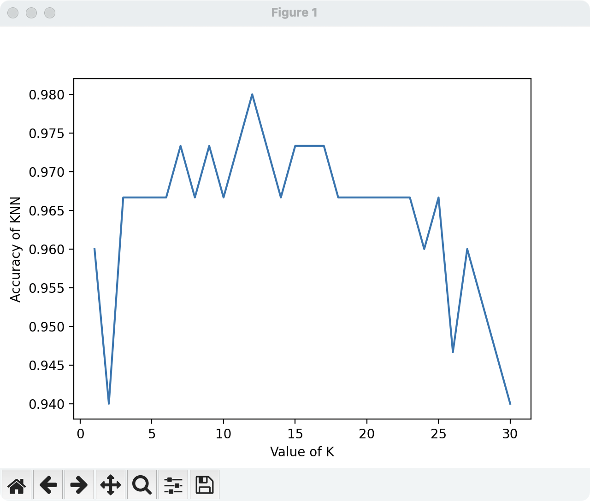
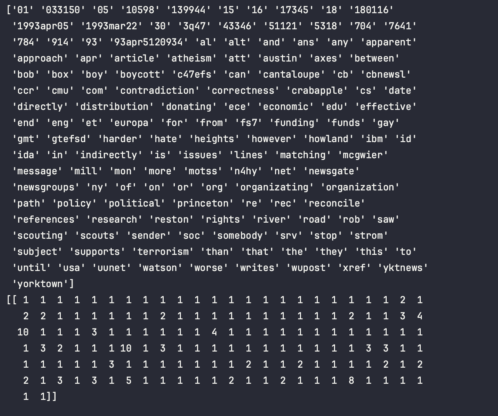
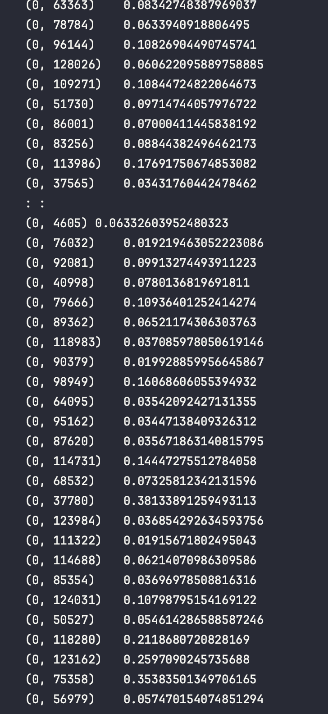
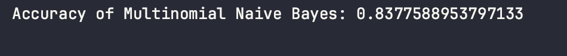
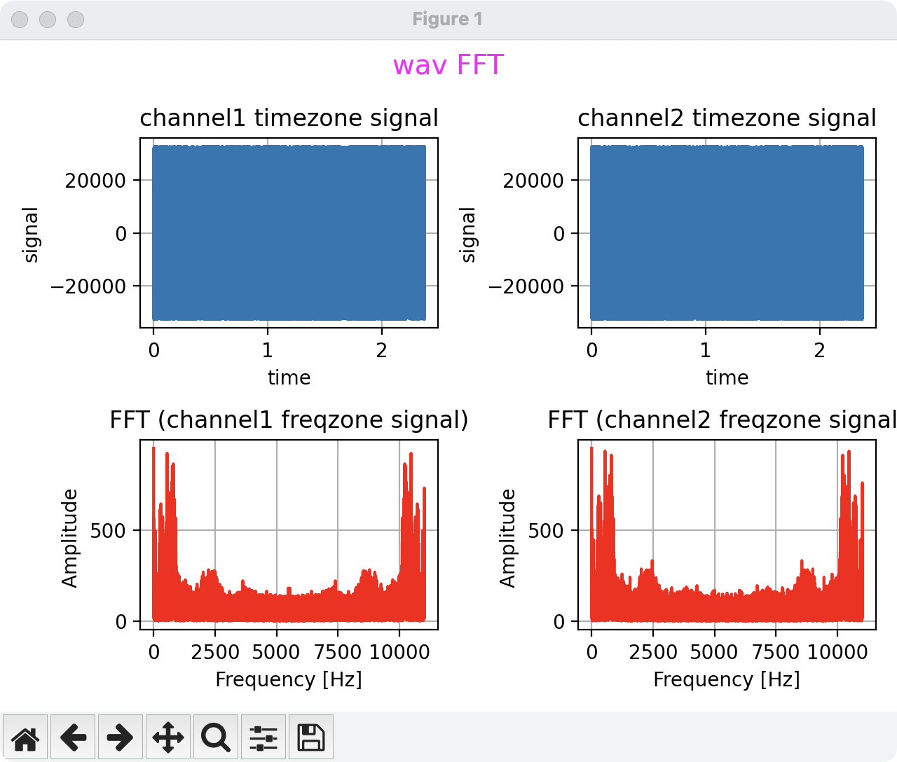
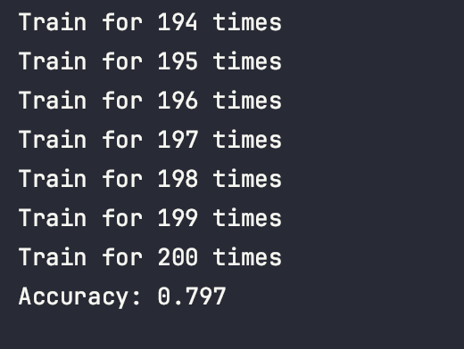
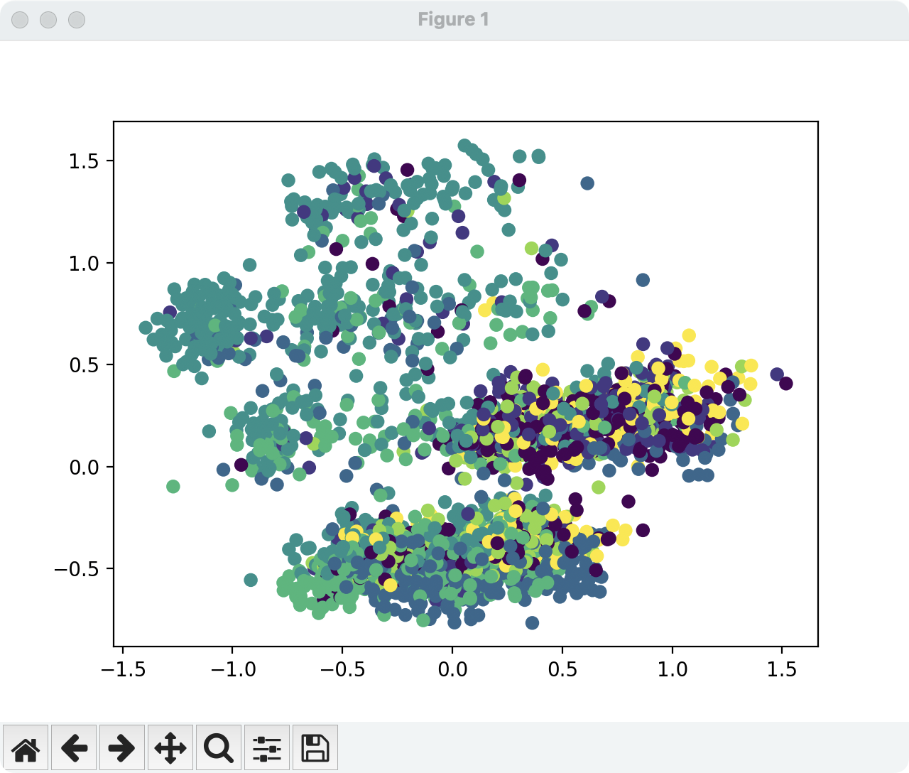

# Introduction to Data Science and Engineering Week 8

## Author: Chenxu Han@ArcueidType
## Student ID: 10225101440

## Week 8 practices:

## Chapter 13:

### Practice 1:

Result:

### Practice 2:

Result:

### Practice 3:

### Practice 8:

> Naive-Bayes in chapter 14 practices

Rainbow source code and documents are in this directory

## Chapter 14:

### Practice 2:

Result:

### Practice 3:

Result:

### Practice 4:

### Practice 5:

Result:

### Practice 8:

Result:

### Practice 9:

Result:

